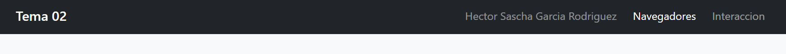
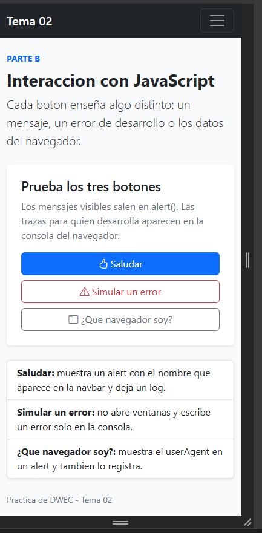
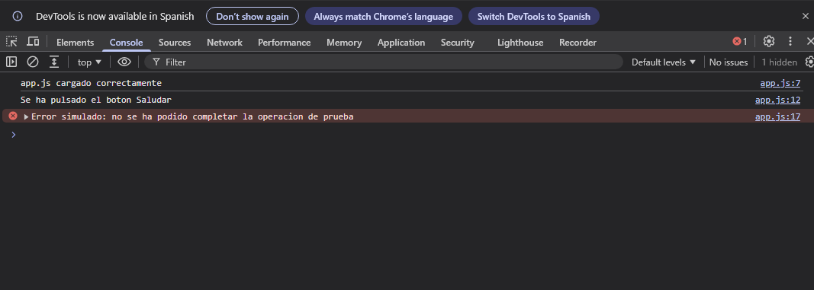
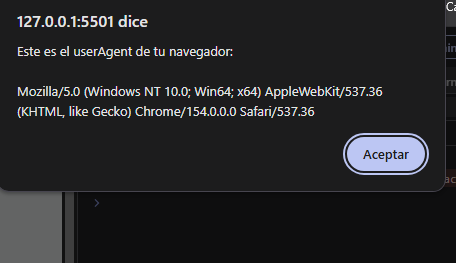
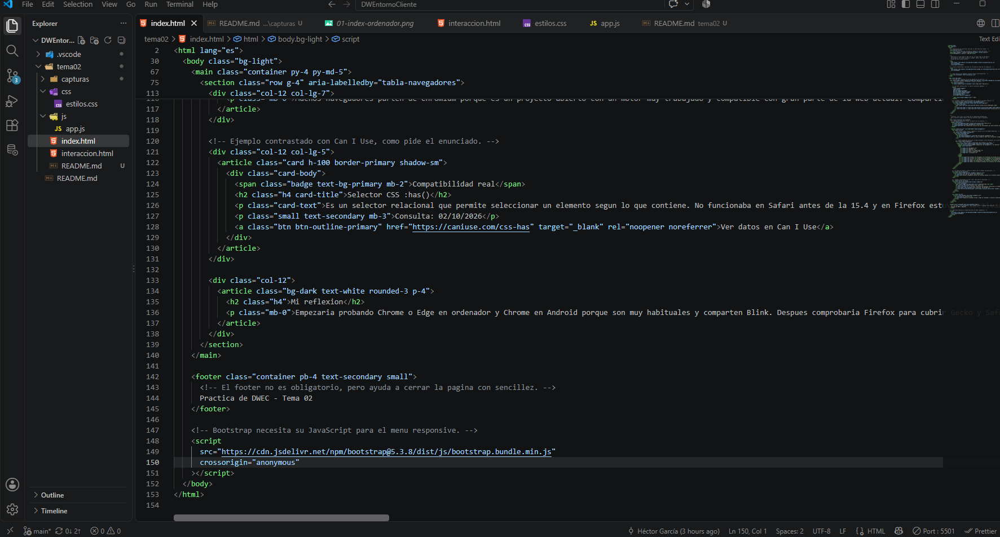

# Tarea 2: Navegadores y primera pagina interactiva

## Antes de entregar

He sustituido el texto de la navbar y de `js/app.js` por `Hector Sascha Garcia Rodriguez`. Todavia tienes que anadir las cinco capturas hechas en tu propio equipo dentro de `capturas/`. No he inventado esas evidencias porque la tarea pide que se vea tu ordenador, tu nombre, Live Server y tus pruebas.

## Que he hecho

En `index.html` he preparado la parte A. La pagina usa la plantilla base de Bootstrap mediante CDN, incluye la etiqueta `viewport` y comparte una navbar con la segunda pagina. La tabla compara Chrome, Firefox, Safari, Edge y Opera: empresa, motor de renderizado, motor de JavaScript y relacion con Chromium. Debajo hay una explicacion redactada para esta practica, un ejemplo de compatibilidad con el selector CSS `:has()` y una reflexion sobre los navegadores que probaria primero.

En `interaccion.html` esta la parte B. He usado una card y un list-group de Bootstrap para organizar los tres botones. El archivo `js/app.js` esta enlazado al final del `body`, tal como pide el enunciado. `saludar()` muestra un `alert()` con el nombre; `simularError()` usa `console.error()` sin abrir una ventana; y `mostrarNavegador()` muestra y registra `navigator.userAgent`. Al cargar la pagina se escribe una traza sencilla para comprobar que el archivo externo se ha cargado.

## Quien hace que

En el boton «Saludar», HTML crea el boton y define el texto y el evento `onclick`. Bootstrap aporta las clases de color, espaciado, tipografia y adaptacion a movil. JavaScript ejecuta la funcion `saludar()`, construye el mensaje con el nombre y escribe la traza en la consola. Por eso las tres capas tienen trabajos distintos: HTML organiza, CSS presenta y JavaScript responde a la accion del usuario.

## User agent

Cuando pulses «¿Que navegador soy?» veras una cadena diferente en Brave y Firefox. Es normal encontrar `Mozilla`, `AppleWebKit` o `Safari` aunque no estes usando exactamente esos navegadores: muchos user agents conservan identificadores historicos para evitar incompatibilidades con paginas antiguas. En Brave y otros navegadores basados en Chromium suele aparecer `Chrome`; en Firefox suelen aparecer `Gecko` y `Firefox`.

## Fuentes consultadas

- MDN, navegadores y motores de renderizado: https://developer.mozilla.org/en-US/docs/Learn_web_development/Getting_started/Environment_setup/Installing_software
- MDN, motores de JavaScript: https://developer.mozilla.org/en-US/docs/Web/JavaScript/Reference/JavaScript_technologies_overview
- Bootstrap 5.3, instalacion por CDN: https://getbootstrap.com/docs/5.3/getting-started/introduction/
- Can I Use, selector `:has()`: https://caniuse.com/css-has (consulta: 02/10/2026)

## Uso de IA

He utilizado ChatGPT como apoyo para organizar la estructura inicial, revisar que se cumplieran los requisitos y aclarar el uso de Bootstrap y JavaScript. He revisado el codigo, he cambiado mi nombre y he hecho las capturas en mi equipo. Antes de entregar terminare la prueba en Firefox y preparare la defensa sin usar autocompletado con IA.

## Capturas de la practica

### 1. Pagina principal en ordenador

Se muestra `index.html` en el ordenador con mi nombre visible en la barra de navegacion.

### 2. Pagina de interaccion en movil

Se muestra `interaccion.html` en modo dispositivo para comprobar que se adapta a una pantalla movil.

### 3. Consola con los botones

Se ven en la consola las trazas generadas al pulsar los tres botones de JavaScript.

### 4. UserAgent en dos navegadores

Se muestra el `userAgent` obtenido al probar la pagina en Brave.

Se muestra el `userAgent` obtenido al probar la pagina en Firefox.

### 5. VS Code y Live Server

Se muestra la carpeta `tema02` abierta en VS Code, con `index.html` abierto y Live Server funcionando en el puerto 5501.
